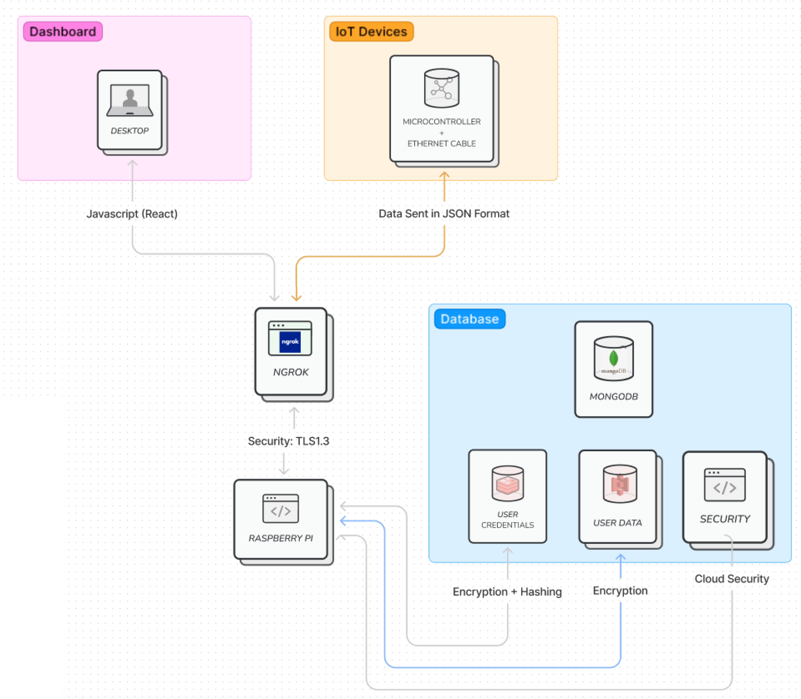

# IOconnect
Final Year Project on IIoT (Industry 4.0), developed using STM32. This project aims to develop a safe and secure IoT network, thereby ensuring data integrity between the communication of IoT devices. To eliminate the need IoT Gateways by utilizing the technical advancements of the modern microcontrollers and to provide a clean UI with Real-time analysis and predictive analysis.  

## Problem Statement
Design and implement a comprehensive Industrial Internet of Things (IIoT) 4.0 solution for optimizing manufacturing processes and enhancing operational efficiency in a smart factory environment.

## Working

It sends sensor data to Raspberry Pi based Server by Encrypting
with AES-256 encryption algorithm. The Verifies data integrity with SHA-256 generated hash.
Real-time monitoring on dashboard and prediction of comapny
growth with Machine Learning.

## Block Diagram

  
  
Block Diagram

## Snaps of the Project

  
  
IOconnect

## MCUs Used
- STM32F446RE - Gathers the data from the sensors, encrypts data using AES-256 Encryption algorithm and sends it to the ESP8266 module .
- ESP8266 - Receives the encrypted data and sends it to the Raspberry Pi based Server.

## Sensors Used
- TBD

## Project Status
- [x] Find Encryption Algorithms (Found: AES-256)
- [x] Find Hashing Algorithms (Found: SHA-256)
- [x] Try out the Algorithms using Python
- [x] Combine the Algorithms with Backend
- [x] Find research papers
- [x] Make PPT 
- [x] Find out about Port Forwarding DNS Port
- [x] Research hosting server on Raspberry-PI
- [x] Make the Raspberry-PI server online
- [x] Decide Online Database
- [x] Conduct Tests on Database
- [x] Implement Encrypted Login
- [ ] Decide Sensors and the MCU
- [ ] Add ML/AI to the project